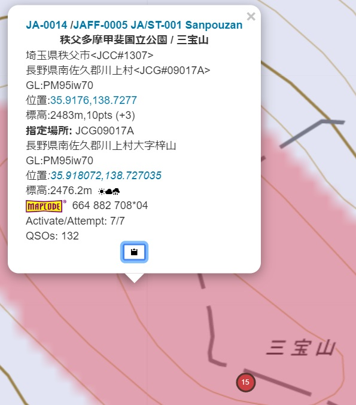

# ActPaddleとは
SOTA/POTAのCWアクティベーションでは外付けのコンパクトなキーヤーが操作性が良く便利です。コンパクトなキーヤーで面倒なのがメモリメッセージの入力です。「ActPaddle」はmyACTと連動し、地図で指定したアクティベーション先のリファレンス番号をメッセージに埋め込み、エレキーのパドル操作をエミュレーションしてメッセージ入力を行うツールです。


***
# 事前準備
## ActPaddleを作る
ハードウェア編を参考にActPaddleを組み立ててください。次にソフトウェア編を参考にM5Burnerを使ってファームウェアを書き込みます。

## ActPaddleを設定する
ActPaddleとPC/スマートフォンは「USBシリアル接続」又は「WiFi接続」で接続することができます。

### USBシリアル回線で接続する
ActPaddleはWindows PCとUSBシリアル接続を行うことができます。事前にUSBシリアル回線速度の設定が必要ですので以下の手順で設定してください。

USBで接続後、デバイスマネージャからUSBシリアルデバイスを選択します。


次にプロパティで接続速度(ビット/秒)を`115200`に設定してください。


最後に後述する[myACTを設定する](#myACTを設定する)の接続方法を「シリアル」に設定してください。

### WiFiで接続する
ActPaddleはスマートフォン(iPhone又はAndroid10以降の端末)のテザリングやモバイルルータに接続することも可能です。

Androidの場合はActPaddleをアクセスポイントとして接続することでWiFi接続することができます[^1]。Androidで使う場合は、本節の接続設定の説明は飛ばして[使ってみよう](#使ってみよう)の節を御覧ください。

#### iPhone/モバイルルータの接続設定
まず最初に接続したいiPhoneやWiFiルータをアクセスポイントとして起動して下さい。iPhoneの場合は「設定」→「インターネット共有」→「ほかの人の接続を許可」でテザリング用のアクセスポイントが有効になります。

次にActPaddleをモバイルバッテリ等につなぎ起動します。ATOMではWiFiの接続状況に応じてLEDの色が以下のように変わります。

|LED色 | 接続状態　|
|:--|:--|
|赤|周囲のアクセスポイントを検索中|
|白|アクセスポイントに接続中|
|緑|WiFiクライアントとしてアクセスポイントに接続済|
|黄|WiFiアクセスポイントとして動作中|

USBケーブルを接続すると周りにあるアクセスポイントを検索（LEDが赤色に点灯します）後、「初期設定用アクセスポイント」として稼働します（LEDが黄色に点灯します）。

LEDが緑に点灯している場合は既存の設定からWiFiクライントとしてアクセスポイントに接続されています。この場合は次の「初期設定用アクセスポイント」の選択は飛ばしてブラウザからアクセスしてください。

次にiPhoneの「設定」→「ネットワークとインターネット」→「インターネット」で、ActPaddleの「初期設定用アクセスポイント」を選びます。SSIDのリストに `ActPaddle`というアクセスポイントがあるはずですので、 パスワード `actpaddle` で接続してください。

次にブラウザから`https://actpaddle.local/`にアクセスします。すると以下の設定画面があらわれます。


ActPaddleの周りにあるアクセスポイントのSSIDの一覧がプルダウンメニューで表示されます。パスワード保存済みのSSIDは"o"が、未保存のものは"x"がついています。

ここで接続するSSIDを選択して下さい。iPhoneの場合は「設定」→「一般」→「情報」→「名前」で設定された名前がSSIDをとして表示されます。

次にパスワードを`Password`欄に入力してください(`Retype`には確認用に同じパスワードを入れてください)。iPhoneの場合は「設定」→「インターネット共有」→「“Wi-Fi”のパスワード」に設定されたパスワードを入力します。

OKボタンを押すと指定されたアクセスポイントのパスワードを保存し接続を開始します。次回以降、ActPaddleに接続可能なアクセスポイントに自動的に接続します。

アクセスポイントは4つまで登録が可能ですので、必要に応じて自宅のWiFiルータ等を追加してください。複数のアクセスポイントに接続できる場合は一番電波強度の強いアクセスポイントに接続します。

また周囲に接続可能なアクセスポイントがない場合は再度「初期設定用アクセスポイント」`ActPaddle`が起動します。前述の手順に従いアクセスポイントを追加してください。

接続不要となったアクセスポイントはSSIDを選択後、DELボタンで削除してください。

なお`actpaddle.local`をアクセスすると「安全ではないサイト」との警告を出ると思います。警告を出さないためには認証局の証明書を端末にインストールする必要があります。自己署名証明書(いわゆるオレオレ証明書)となりますが`cert/ca.crt`をPC/スマホにインストールしてください。

## myACTを設定する
ActPaddleが接続できることを確認したら[myACT](https://myact.sotalive.net/)を開き、設定画面からパドルエミュレータを「使用する」にチェックを入れてください。

次に接続方法を選択します。USBシリアル接続の場合は「シリアル」を、WiFi接続の場合は「Host」を選択しホスト名を入力します。通常は`actpaddle.local`から変更する必要はありません[^1]。


[^1]:ActPaddleがマルチキャストDNSでIPアドレスを通知しているためテザリング等の環境でも名前でアクセスすることができます。Androidではテザリングのアクセスポイントに接続した際にアクセスポイントがマルチキャストDNSで告知された名前を認識しないため接続ができません。このためActPaddleをアクセスポイントとして接続することでマルチキャストDNSでの名前解決を行っています。

# 使ってみよう
Androidに接続する場合のみ一部使い方が異なりますのでご注意ください。

## myACTからメッセージを送る
myACTでアクティベーション先をクリックすると下にメモアイコンが現れます。


アイコンをクリックするとActPaddleのダイアログが現れます。


コールサインを入力し、キーヤーに書き込みたいメッセージを各欄に入力します。メッセージ中の`$`で始まる変数は以下のように書き換えられます。

|変数 | 置き換えられる文字　|
|:--|:--|
|`$CALL` |CALL欄 (チェックを入れるエリアも入ります)|
|`$JCC`  |JCC/JCG欄 (地図位置から自動入力)|
|`$JCG`  |JCC/JCG欄 (地図位置から自動入力)|
|`$SOTA` |SOTA欄 (地図位置から自動入力)|
|`$POTA` |POTA欄 (地図位置から自動入力)|
|`$JAFF` |JAFF欄 (地図位置から自動入力)|

尚、リファレンス番号中のハイフンは送出時には省略されます。

アクティベーション位置が判明している場合は地図上でその点をクリックすると位置情報からすべての情報が自動入力されます。




その他、特殊符号として以下のものがあります。

|記号 | 符号　|
|:--|:--|
|+ | AR|
|= | BT|
|# |１秒送出停止|

Pocket KeyerのようにCWメッセージで書き込み先を指定するキーヤー等に`#`記号を使います。上記のダイアログにあるNo.4のメッセージではPocketKeyerの1番メモリを指定した後、キーヤー側の応答メッセージを待つため一秒間の休止をいれています。

次にパドルエミュレータの速度を調整します。キーヤーによって最適な速度が変わりますので適宜調整してください。ちなみに蚰蜒倶楽部のキーヤーは速度を最速にして設定して40wpm、Pocket Keyerは本体速度を最速にして35wpm、KX2の場合はタイミングが厳しくKX2側が35wpm程度、ActPaddle側が40wpmで書き込めています。

最後にキーヤーをActPaddleに接続して録音モードに設定、SENDボタンを押してください。キーイングが始まります。（WiFi接続時は一番最初の接続だけワンテンポ遅れて送出されます）うまく録音出来ない場合はキーヤー本体の速度調整やActPaddleのwpm値を変更してください。キーヤー本体よりActPaddle側を若干速めに設定すると良いようです。

パドル極性は3.5mmプラグの先端側を長点としていますが、左右逆転する場合は「Reverse Paddle」にチェックを入れてください。「Straight」を選択するとプラグ先端・グラウンド間をストレートキーとしてキーイングします。

なお入力したコールサインやメッセージはブラウザに保存されます。スマホからアクセスした場合など、ブラウザが異なる場合は個別にメッセージを保存する必要があるのでご注意ください。

## AndroidにWiFi接続する場合
Androidに接続する場合はテザリングではなく、ActPaddleのアクセスポイントに直接接続します。

まず最初にスマートフォンがインターネット環境にアクセスできる状態で、アクティベーション先を選択し、パドルダイアログを表示して所定のメッセージを入力してください。ActPaddleのアクセスポイントに先に接続してしまうとインターネットに接続できないため地図の表示ができません。

次に、この状態でWiFi設定を開き、アクセスポイント`ActPaddle`を選択し接続します。接続後に`SEND`ボタンを押すとキーヤーにメッセージが送出されます。

メッセージ送出後は再びWiFi設定を開き、アクセスポイント`ActPaddle`との接続を切断してください。

***
# ハードウェア編
## 必要な部品

1. ESP32(Xtensa又はRISC-V) x1
[M5 AtomLite](https://akizukidenshi.com/catalog/g/gM-17209/) 
[M5StampC3U](https://www.switch-science.com/products/7894)
[Seeed Studio XIAO ESP32C3](https://akizukidenshi.com/catalog/g/gM-17454/)など
2. フォトカプラ[TL293](https://akizukidenshi.com/catalog/g/gI-16783/)など x2
4. 抵抗 100Ω 1/6W (フォトカプラ・LED電流制限用) x3
5. [ジャック(パドル接続用)](https://akizukidenshi.com/catalog/g/gK-05363/) x1
6. [ATOMICプロトキット](https://www.switch-science.com/products/6345)(M5 ATOMを使う場合)
6. [ピンヘッダ](https://akizukidenshi.com/catalog/g/gC-00167/) x1  ユニバーサル基板 x1 (M5Stamp/XIAO ESP32C3を使う場合)
7. LED (XIAO ESP32C3を使う場合)

## 回路構成
3.5mmステレオジャックに繋げたトランシーバをフォトカプラでキーイングします。長点側を3.5mmプラグの先端側(L),短点側を真ん中のリング(R)、グラウンドを根元側(G)に接続します。ActPaddleのグラウンド(USBのグラウンド)とは接続しないように注意してください。

GPIOから電流制限用の100オームを介してフォトカプラのLEDに接続します。GPIO出力は使うボードによって異なりますので、以下の表に従い適宜読み替えてください。

また動作表示用のLEDはM5ATOM/Stampは内蔵のシリアルLEDを使います。XIAO ESP32C3はGPIO4を割り当てていますので電流制限用抵抗を付けて適宜LEDを接続してください。


### M5ATOM
|GPIO|入出力|機能|
|:---|:-----|:-----|
| 23 | 出力 | 長点|
| 33 | 出力 | 短点|

### M5StampC3U
|GPIO|入出力|機能|
|:---|:-----|:-----|
| 3 | 出力 | 長点|
| 4 | 出力 | 短点|

### XIAO ESP32C3
|GPIO|入出力|機能|
|:---|:-----|:-----|
| 2(D0)| 出力 | 長点|
| 3(D1) | 出力 | 短点|
| 4(D2) | 出力 | LED|

なお、詳細な製作手順をJP3DGT局がまとめていただきました。[こちら](http://jp3dgt.blog.fc2.com/blog-entry-804.html)もあわせてごらんください。

***
# ソフトウェア編
## コンパイル済みファームウェアをインストールする場合
### M5ATOM/M5Stampの場合
M5Statck社の[サイト](https://docs.m5stack.com/en/download)からM5Burnerをダウンロードしてインストールしてください(UIFLOW FIRMWARE BURNING TOOLにあります)。


左側の製品の選択でATOM又はSTMAPを選択後、上部の検索窓に"ActPaddle"と入力するとアップロード済みファイルが検索されます。”Download"を押してダウンロードした後、ハードウェア編で作ったハードをUSB接続します。接続後、"BURN"を押すと書込みが始まります。無事書込みが終わるとアクセスポイントモードで立ち上がります（赤いランプが点灯）。[事前の設定](#事前の設定)を参照して設定をしてください。

### XIAO ESP32C3の場合
githubの[リリースページ](https://github.com/w-ockham/ActPaddle/releases)にソースファイル一式と一緒にコンパイル済みのバイナリファイルが置いてあります。
Pythonをインストール後、pipでesptoolをインストールしてください。
```
pip install esptool
```
次にダウンロードしたバイナリを`esptool.py`コマンドを使って書き込みます。シリアルポートはデバイスマネージャで表示されるシリアルポート名(COM1など)に置き換えてください。
```
esptool --port シリアルポート write_flash 0x00000 esp32c3-actpaddle.bin
```
書込み後は[事前の設定](#事前の設定)を参照し設定をしてください。

## ソースファイルからコンパイルする場合
### 開発環境の構築
Ubuntu又はWindowsに[WSL2をインストール](https://learn.microsoft.com/ja-jp/windows/wsl/install)した環境を準備してください。

次にRustを[インストール](https://www.rust-lang.org/tools/install)します。次に以下の手順でgccや開発環境をインストールします。
```
sudo apt-get install -y gcc build-essential curl pkg-config
```
次にRustでESP-IDFの開発環境をインストールするクレート[espup](https://github.com/esp-rs/espup)をインストールします。cargoコマンドでコンパイルが完了すると`espup`コマンドがインストールされますのでinstallコマンドでESP32用のツールチェインをインストールしてください。
```
cargo install espup
espup install
```
これでESP32系のXtensa.ESP32C3のRISC-Vのクロスコンパイル環境がインストールされます。

ActPaddleをコンパイルする際はターゲットを`.cargo/config.toml`で指定します。またrustflagsで`board`というfeatureを使ってボード毎のピンアサインを変更しています。ターゲット変更時にはこちらも修正漏れがないようにしてください。

またESP-IDFは4系の最新版v4.4.5(2023/9/16現在)を使っています。初期設定をボード毎に変更する必要があるため、環境変数’ESP_IDF_SDKCONFIG_DEFAULTS'でXtensa用(`sdkconfig.defaults.esp32`), RISC-V用(`sdkconfig.defaults.esp`)を選択してください。

```toml
[build]
#target = "riscv32imc-esp-espidf"
target = "xtensa-esp32-espidf"

[target.riscv32imc-esp-espidf]
linker = "ldproxy"
# runner = "espflash --monitor" # Select this runner for espflash v1.x.x
runner = "espflash flash --monitor" # Select this runner for espflash v2.x.x
#rustflags = ["-C", "default-linker-libraries", "--cfg", "board=\"m5stamp\""]
rustflags = ["-C", "default-linker-libraries", "--cfg", "board=\"xiao-esp32c3\""]

[target.xtensa-esp32-espidf]
linker = "ldproxy"
# runner = "espflash --monitor" # Select this runner for espflash v1.x.x
runner = "espflash flash --monitor" # Select this runner for espflash v2.x.x
rustflags = ["-C", "default-linker-libraries", "--cfg", "board=\"m5atom\""]

[unstable]
build-std = ["std", "panic_abort"]

[env]
# Note: these variables are not used when using pio builder (`cargo build --features pio`)
ESP_IDF_VERSION = "v4.4.5"
ESP_IDF_SDKCONFIG_DEFAULTS = "sdkconfig.defaults.esp32" 
#ESP_IDF_SDKCONFIG_DEFAULTS = "sdkconfig.defaults.esp" 
````
### サーバー証明書・サーバ秘密鍵の生成
WiFi版のActPaddleはChrome上のJavascriptからhttpsを使ってアクセスされます。そのためhttpsサーバのサーバー証明書・サーバー秘密鍵をコンパイル時にコード中に埋め込んでいます。ここではサーバー証明書・サーバー秘密鍵の作り方を説明します。
#### CA秘密鍵・CA証明書の作成
サーバー証明書を発行するためのルート認証局(ルートCA)を作ります。まずはCA秘密鍵を生成します。
```
openssl genrsa -out ca.key 2048
```
次にCSR(Certificate Signing Request)とCAの公開鍵を生成します。
```
openssl req -new -key ca.key -out ca.csr -subj "/C=JP/CN=ActPaddle CA"
```
次に証明属性定義ファイル`ca.ext`に以下を記載します。
```
[ v3_ca ]
basicConstraints = critical, CA:true
keyUsage = keyCertSign, cRLSign
extendedKeyUsage = serverAuth, clientAuth
subjectKeyIdentifier = hash
authorityKeyIdentifier = keyid,issuer
```
最後にCA証明書を生成します。
```
openssl x509 -req \
    -signkey ca.key \
    -extfile ca.ext \
    -extensions "v3_ca" \
    -in ca.csr \
    -out ca.crt \
    -days 3650 \
    -sha256
```

#### サーバ証明書・サーバ秘密鍵の生成
まずサーバの秘密鍵を生成します。生成した秘密鍵`prvtkey.pem`はコンパイル時に参照するため`./cert/private/`の下においてください。
```
openssl genrsa -out prvtkey.pem 2048
```
次にサーバーのCSRを作ります。
```
openssl req -new -key prvtkey.pem -out server.csr -subj "/CN=actpaddle.local"
```
認証局と同様にサーバー証明書属性定義ファイル`server.ext`に以下を記載します。
```
[ v3_server ]
basicConstraints = critical, CA:false
keyUsage = digitalSignature, keyEncipherment
extendedKeyUsage = serverAuth, clientAuth
subjectKeyIdentifier = hash
authorityKeyIdentifier = keyid,issuer
subjectAltName = DNS:actpaddle.local
```
最後にCA認証鍵でサーバー証明書`cacert.pem`を生成します。有効期限(-days)は任意に設定できますが365日以上の値を設定するとiOSではエラーとなるようです。こちら`cacert.pem`も`./cert/private/`の下においてください。
```
openssl x509 -req -CAkey ca.key -CA ca.crt -CAcreateserial -extfile server.ext -extensions "v3_server" -in server.csr -out cacert.pem -days 365 -sha256
```
### コンパイルと実行
WSL環境の場合はUSBデバイスをWSL環境からアクセスできるようにするため、[こちらの記事](https://jl1nie.wordpress.com/2023/04/08/rust%e3%81%a7l%e3%83%81%e3%82%ab%e3%81%97%e3%81%a6%e3%81%bf%e3%81%9f/)を参考に事前設定をしてください。

シリアル環境が整ったら
```
carogo run --release
```
でビルド・コンパイル・フラッシュへの書込みとシリアル回線のモニターを開始します。最初のコンパイルではESP-IDFのビルドから行いますのでかなり時間がかかります。

フラッシュの書込み後、以下のようなメッセージが表示されればOKです。


