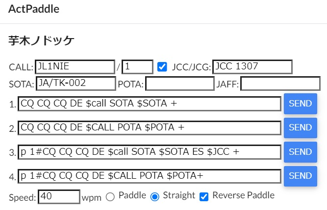

# ActPaddleとは
SOTA/POTAのCWアクティベーションでは外付けのコンパクトなキーヤーが操作性が良く便利です。コンパクトなキーヤーで面倒なのがメモリメッセージの入力です。「ActPaddle」はmyACTと連動し、地図で指定したアクティベーション先のリファレンス番号をメッセージに埋め込み、エレキーのパドル操作をエミュレーションしてメッセージ入力を行うツールです。


***
# 事前の設定
## WiFiクライアントの設定
ハードウェア編を参考にActPaddleを組み立ててください。次にソフトウェア編を参考にM5Burnerを使ってファームウェアを書き込みます。USBケーブルを接続するとアクセスポイントの検索（赤色点灯）後、アクセスポイントとして稼働します。次にスマートフォンなどでSSID `ActPaddle` パスワード `actpaddle` でアクセスポイントに接続してください。`https://actpaddle.local/`にアクセスすると以下の表示が現れます。


アクセスポイント検索で得られたSSIDの一覧がプルダウンメニューで表示されます。パスワード保存済みのSSIDは"o"が、未保存のものは"x"がついています。接続するSSIDを選択後、パスワードを`Password`欄に入力してください(`Retype`には確認用に同じパスワードを入れてください)。OKボタンを押すとパスワードを設定し接続を開始します。アクセスポイントは4つまで登録が可能です。不要なアクセスポイントはSSIDを選択後、DELボタンで削除してください。

なお`actpaddle.local`をアクセスすると「安全ではないサイト」との警告を出ると思います。警告を出さないためには認証局の証明書を端末にインストールする必要があります。自己署名証明書(いわゆるオレオレ証明書)となりますが`cert/ca.crt`をPC/スマホにインストールしてください。

## シリアル回線の設定
WindowsPCでシリアル接続をする場合、シリアル回線速度の設定が必要です。USBで接続後、デバイスマネージャからUSBシリアルデバイスを選択します。


次にプロパティで接続速度(ビット/秒)を`115200`に設定してください。


## myACTの設定
[myACT](https://myact.sotalive.net/)を開き、設定画面からパドルエミュレータを「使用する」にチェックを入れてください。次に接続方法を選択します。WiFi接続の場合はホスト名を入力します。ActPaddleがマルチキャストDNSでIPアドレスを通知しているため通常は'actpaddle.local'から変更する必要はありません。


# 使ってみよう
myACTでアクティベーション先をクリックすると下にメモアイコンが現れます。


アイコンをクリックするとActPaddleのダイアログが現れます。



コールサインを入力し、キーヤーに書き込みたいメッセージを各欄に入力します。メッセージ中の`$CALL` `$SOTA` `$POTA` `$JAFF`の部分は入力したコールサインやリファレンス番号に置き換えられます。またリファレンス番号中のハイフンは送出時には省略されます。

また特殊符号として以下のものがあります。

|記号 | 符号　|
|:--|:--|
|+ | AR|
|= | BT|
|# |１秒送出停止|

Pocket KeyerのようにCWメッセージで書き込み先を指定するキーヤー等に`#`記号を使います。上記のダイアログにあるNo.4のメッセージではPocketKeyerの1番メモリを指定した後、キーヤー側の応答メッセージを待つため一秒間の休止をいれています。

次にパドルエミュレータの速度を調整します。キーヤーによって最適な速度が変わりますので適宜調整してください。ちなみに蚰蜒倶楽部のキーヤーは速度を最速にして設定して40wpm、Pocket Keyerは本体速度を最速にして35wpm、KX2の場合はタイミングが厳しくKX2側が35wpm程度、ActPaddle側が40wpmで書き込めています。

最後にキーヤーをActPaddleに接続して録音モードに設定、SENDボタンを押してください。キーイングが始まります。（WiFi接続時は一番最初の接続だけワンテンポ遅れて送出されます）うまく録音出来ない場合はキーヤー本体の速度調整やActPaddleのwpm値を変更してください。キーヤー本体よりActPaddle側を若干速めに設定すると良いようです。

パドル極性は3.5mmプラグの先端側を長点としていますが、左右逆転する場合は「Reverse Paddle」にチェックを入れてください。「Straight」を選択するとプラグ先端・グラウンド間をストレートキーとしてキーイングします。

なお入力したコールサインやメッセージはブラウザに保存されます。スマホからアクセスした場合など、ブラウザが異なる場合は個別にメッセージを保存する必要があるのでご注意ください。

***
# ハードウェア編
## 必要な部品

1. ESP32(Xtensa又はRISC-V)　[M5 AtomLite](https://akizukidenshi.com/catalog/g/gM-17209/),[M5StampC3U](https://www.switch-science.com/products/7894),[Seeed Studio XIAO ESP32C3](https://akizukidenshi.com/catalog/g/gM-17454/)
2. フォトカプラ[TL293](https://akizukidenshi.com/catalog/g/gI-16783/)など x2
4. 抵抗 100Ω (フォトカプラ・LEDの電流制限用) x2
5. [ジャック(パドル接続用)](https://akizukidenshi.com/catalog/g/gK-05363/) x1
6. ブレッドボードなど x 2

## 回路構成
3.5mmステレオジャックをフォトカプラでキーイングします。長点側を3.5mmプラグの先端側(L),短点側を真ん中のリング(R)、グラウンドを根元側(G)に接続します。GPIOから電流制限用の100オームを介してフォトカプラのLEDに接続します。GPIO出力は使うボードによって異なります。

回路図(TBD)

また動作表示用のLEDはM5ATOM/Stampは内蔵のシリアルLEDを使います。XIAO ESP32C3はGPIO4を割り当てていますので電流制限用抵抗を付けて適宜LEDを接続してください。
### M5ATOM
|GPIO|入出力|機能|
|:---|:-----|:-----|
| 23 | 出力 | 長点|
| 33 | 出力 | 短点|

### M5StampC3U
|GPIO|入出力|機能|
|:---|:-----|:-----|
| 3 | 出力 | 長点|
| 4 | 出力 | 短点|

### XIAO ESP32C3
|GPIO|入出力|機能|
|:---|:-----|:-----|
| 2 | 出力 | 長点|
| 3 | 出力 | 短点|
| 4 | 出力 | LED|

## 開発環境について
WSL2でRustを[インストール](https://www.rust-lang.org/tools/install)後、[espup](https://github.com/esp-rs/espup)を使ってXtensa用のツールチェインを入れています。ターゲットは`.cargo/config.toml`で指定します。またrustflagsで`board`というfeatureを使ってボード毎のピンアサインを変更しています。ターゲット変更時にはこちらも修正漏れがないようにしてください。

またESP-IDFは4系の最新版v4.4.5(2023/9/16現在)を使っています。初期設定をボード毎に変更する必要があるため、環境変数’ESP_IDF_SDKCONFIG_DEFAULTS'でXtensa用(`sdkconfig.defaults.esp32`), RISC-V用(`sdkconfig.defaults.esp`)を選択してください。

```toml
[build]
#target = "riscv32imc-esp-espidf"
target = "xtensa-esp32-espidf"

[target.riscv32imc-esp-espidf]
linker = "ldproxy"
# runner = "espflash --monitor" # Select this runner for espflash v1.x.x
runner = "espflash flash --monitor" # Select this runner for espflash v2.x.x
#rustflags = ["-C", "default-linker-libraries", "--cfg", "board=\"m5stamp\""]
rustflags = ["-C", "default-linker-libraries", "--cfg", "board=\"xiao-esp32c3\""]

[target.xtensa-esp32-espidf]
linker = "ldproxy"
# runner = "espflash --monitor" # Select this runner for espflash v1.x.x
runner = "espflash flash --monitor" # Select this runner for espflash v2.x.x
rustflags = ["-C", "default-linker-libraries", "--cfg", "board=\"m5atom\""]

[unstable]
build-std = ["std", "panic_abort"]

[env]
# Note: these variables are not used when using pio builder (`cargo build --features pio`)
ESP_IDF_VERSION = "v4.4.5"
ESP_IDF_SDKCONFIG_DEFAULTS = "sdkconfig.defaults.esp32" 
#ESP_IDF_SDKCONFIG_DEFAULTS = "sdkconfig.defaults.esp" 
